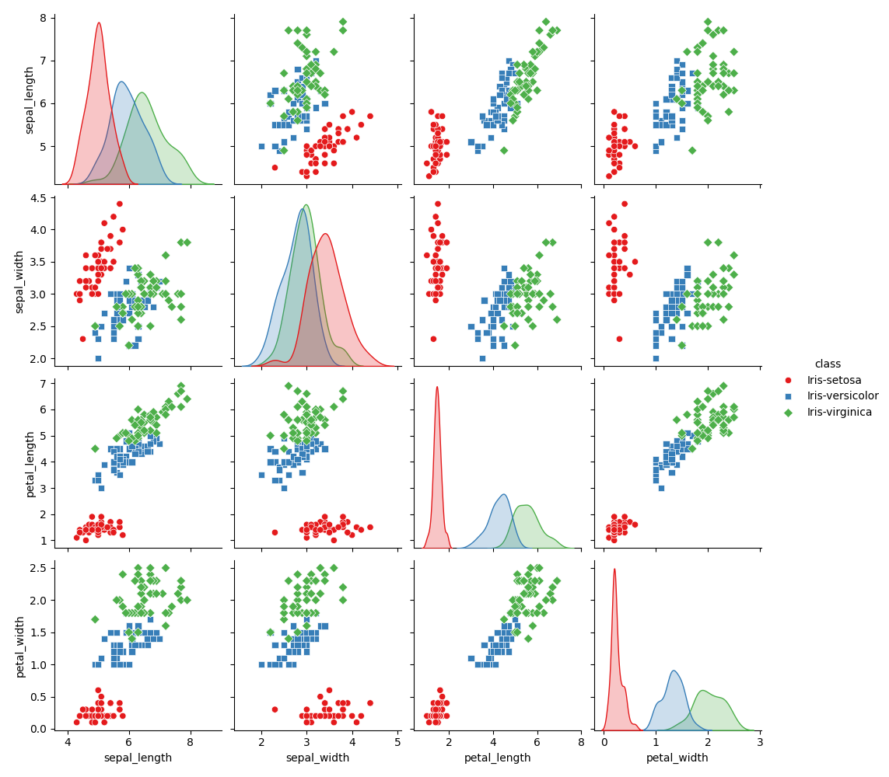
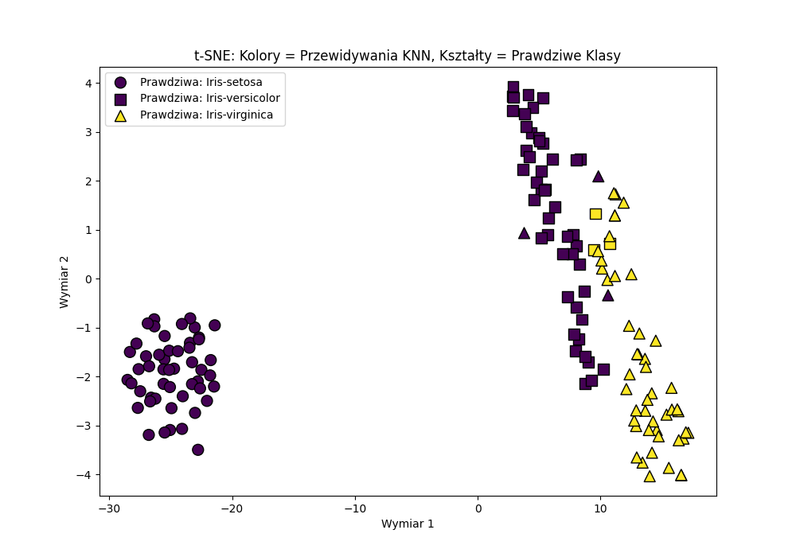

# Sprawozdanie: Klasyfikacja zbioru Iris
**Indeks:** 119066  
**Grupa:** 1 (Indeks parzysty - Klasyfikacja algorytmem KNN)

### 1. Krótka analiza danych
Zbiór danych Iris składa się z 150 próbek (po 50 dla każdego z trzech gatunków: *Setosa*, *Versicolour*, *Virginica*). Każda próbka opisana jest czterema atrybutami geometrycznymi (długość i szerokość płatka oraz działki kielicha). Analiza wstępna wykazała, że klasa *Setosa* jest liniowo separowalna od pozostałych, natomiast cechy klas *Versicolour* i *Virginica* w dużej mierze się przenikają.

### 2. Wyniki klasyfikacji (KNN, K=3)
Dane zostały podzielone na zbiór treningowy (80%) i testowy (20%). Użyto algorytmu K-Nearest Neighbors z parametrem $K=3$. Model został oceniony na zbiorze testowym (30 próbek), uzyskując maksymalne wyniki we wszystkich wymaganych metrykach:
* **Accuracy (Dokładność):** 1.00
* **Precision (Precyzja):** 1.00
* **Recall (Czułość):** 1.00
* **F1-score:** 1.00

### 3. Wizualizacja t-SNE i Wnioski
Zredukowano 4-wymiarowe dane do 2 wymiarów za pomocą algorytmu t-SNE. Na poniższym wykresie:
* **Kształty** oznaczają prawdziwy gatunek kwiatu z oryginalnego zbioru.
* **Kolory** oznaczają klasę przypisaną przez wyuczony model KNN.

**Krytyczny wniosek:** Wynik 1.00 w metrykach na zbiorze testowym jest w tym przypadku rezultatem małej próby badawczej (zaledwie 30 losowych próbek, które ułożyły się korzystnie). Wykres t-SNE dla całego zbioru obnaża prawdziwą naturę danych – o ile klasa *Setosa* jest całkowicie oddzielona, to kształty reprezentujące klasy *Versicolour* i *Virginica* fizycznie na siebie nachodzą. Oznacza to, że idealny wynik na zbiorze testowym jest zbyt optymistyczny, a w strefie granicznej tych dwóch gatunków model nieuchronnie będzie popełniał błędy przy wprowadzaniu nowych danych.